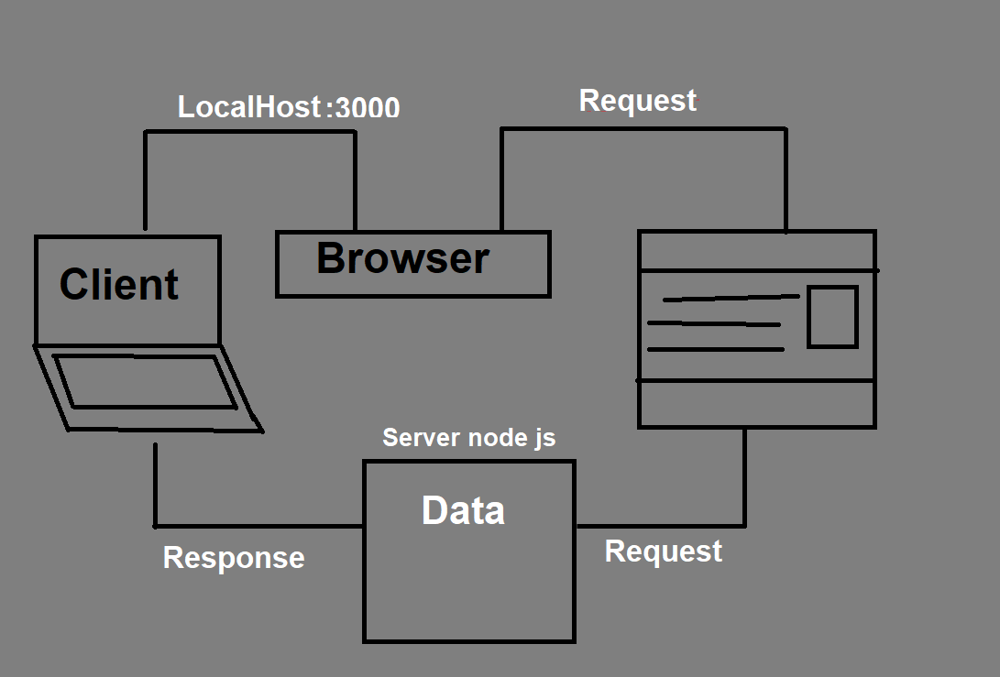

# Movies-Library

**Author Name**: *Rajeh Dalbah*

## WRRC

## Overview
servar to browse movies and favorites movies list.
## Getting Started
you should have a ubunto to connecting with GitHub.

you should Initialize by running this command "npm init -y".

you should Install the required packages like : npm install express cors, to run the project.

to start server command "npm start" so the server will run.

## Project Features
Show movies from the server.

Favorie list.