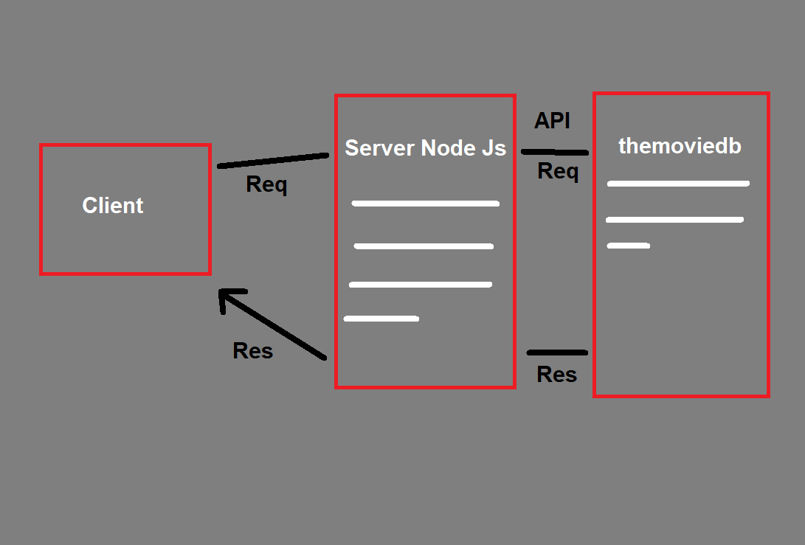
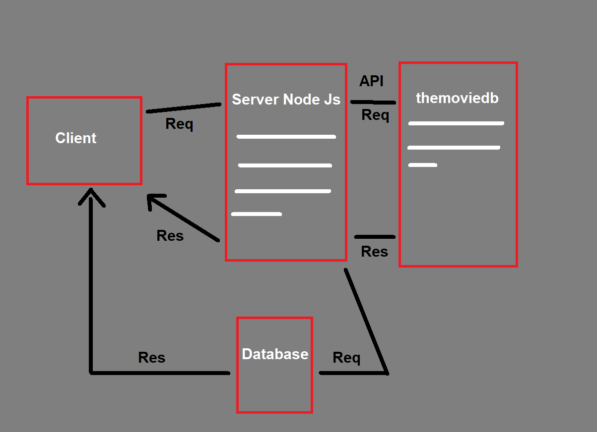

# Movies-Library

**Author Name**: *Rajeh Dalbah*

## WRRC

## Overview
servar to browse movies and favorites movies list.
## Getting Started
you should have a ubunto to connecting with GitHub.

you should Initialize by running this command "npm init -y".

you should Install the required packages like : npm install express cors, to run the project.

you should Install that packages to run this project its:  express, cors, axios.

install Postgres Database.

create databse with rhe name "movie".

connect database with server using command "psql -d movie -f schema.sql".

use the url to proccesing what you want.

to start server command "npm start" so the server will run.

## Project Features
Show movies from the server.

Favorie list.

Search movies.

show classic movie from classic route. 

you can show Robert de Niro Movies.

add movies to database.

get movies to database.

update movie from database.

delete movie from database.

get specific movie from database.